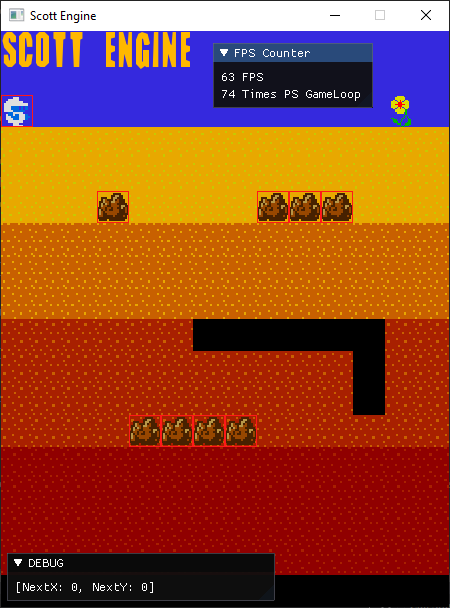

# Scott Engine
Always run GenerateProject.bat first if you open up the project for the first time!

A 2D Game Engine made for an assignment at DAE (howest) Kortrijk.

I started the engine from scratch following TheCherno on youtube! Big thanks to him!

## 3rd Party Libraries
 - [SDL2](https://www.libsdl.org/download-2.0.php)
 - [SDL2_image](https://www.libsdl.org/projects/SDL_image/)
 - [SDL2_ttf](https://www.libsdl.org/projects/SDL_ttf/)
 - [glm](https://github.com/g-truc/glm)
 - [spdlog](https://github.com/gabime/spdlog)

## Reference
[Dig Dug for NES](https://www.retrogames.cz/play_012-NES.php) : Online version of the game

## ScreenShot

